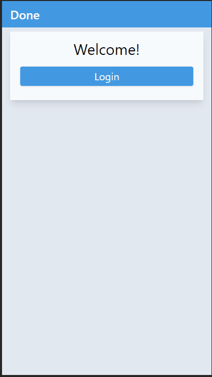

# DoneApp

E-Payment Made Easy: Consider It Done.

This application is assumed to be integrated with [done] service as its backend.

## Supported Commands:

- `ng serve`: dev server at `http://localhost:4200`
- `ng generate`: generate component, services etc.
- `ng build`: build project
- `ng test`: unit tests
- `ng e2e`: end-to-end tests

[done]: https://github.com/malcolm-kee/done
